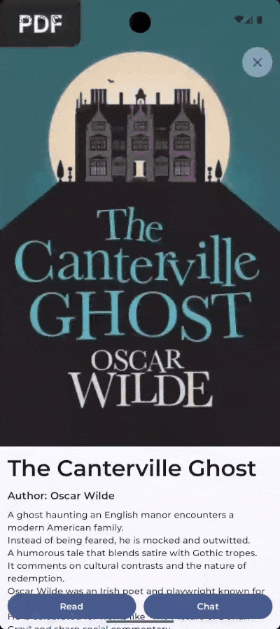
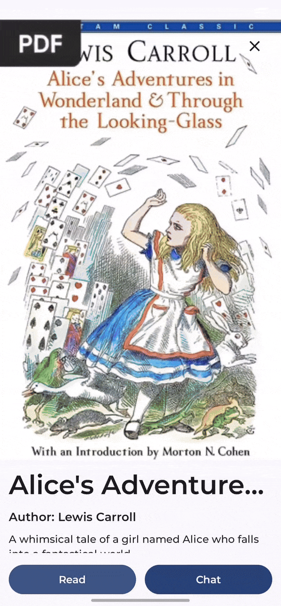
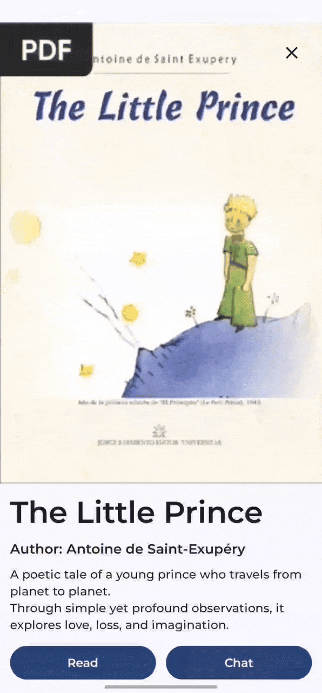
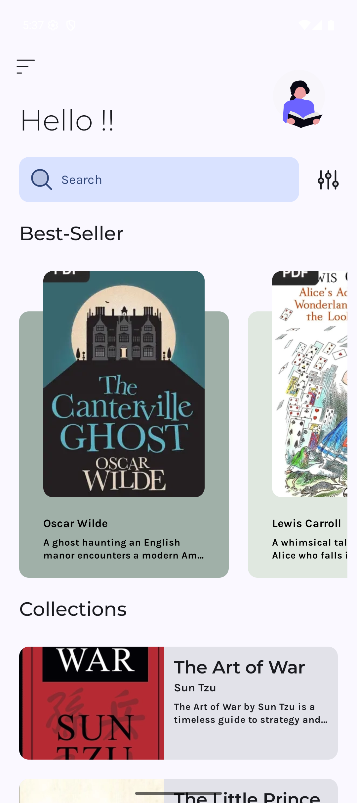
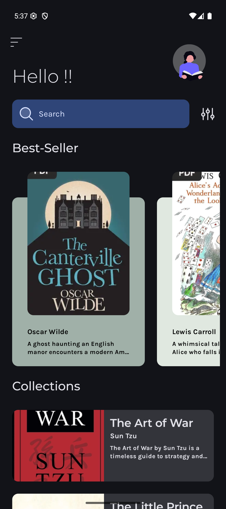
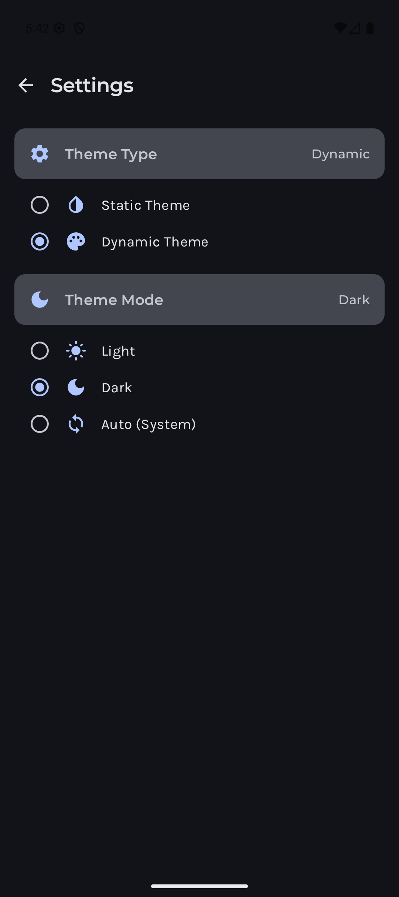
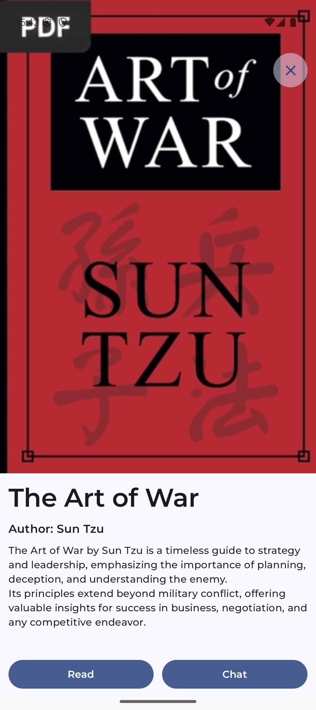

<div align="center">


# 📚 StoryVoyage
### *Your Intelligent Reading Companion*

[](https://android.com/)
[](https://kotlinlang.org/)
[](https://developer.android.com/jetpack/compose)
[](LICENSE)
[]()

*Transform your reading experience with AI-powered assistance, voice recognition, and seamless PDF interaction*

[🚀 **Get Started**](https://github.com/akshay2211/StoryVoyage/tree/main#-quick-start) • [📱 **Features**](https://github.com/akshay2211/StoryVoyage/tree/main#-features) • [🎥 **Demo**](https://github.com/akshay2211/StoryVoyage/tree/main#-demo) • [🏗️ **Architecture**](https://github.com/akshay2211/StoryVoyage/tree/main#%EF%B8%8F-architecture) • [📖 **Blog**](https://www.nutrient.io/blog/from-zero-to-ai-building-custom-chat-interfaces-with-nutrient-on-android/)

</div>

---

## 🌟 Why StoryVoyage?

**StoryVoyage** revolutionizes the way you interact with digital content. Combining cutting-edge AI technology with intuitive design, it creates an immersive reading ecosystem that adapts to your needs. Whether you're studying, researching, or reading for pleasure, StoryVoyage transforms every document into an interactive conversation.

## 🎥 Demo
Experience the app's features in action with these interactive demonstrations.

<div align="center">

### 🚀 App Launch & Navigation


*Smooth app launch with elegant transitions and intuitive navigation*

---

### 🤖 AI Assistant in Action


*Real-time AI conversations with intelligent responses and context awareness*

---

### 📖 PDF Reader Experience


*Advanced PDF viewing with smooth scrolling and professional rendering*

---

### 🎤 Voice Recognition


*Hands-free interaction with accurate voice-to-text conversion*

</div>

---

## 📱 Features

<table>
<tr>
<td width="50%">

### 🤖 **AI-Powered Intelligence**
Get instant answers, summaries, and insights from your documents. Our advanced AI assistant understands context and provides relevant information tailored to your reading needs.

### 🎤 **Voice Recognition**
Navigate hands-free with advanced voice commands. Perfect for accessibility and multitasking while maintaining full control over your reading experience.

### 📄 **Advanced PDF Viewer**
Industry-leading PDF rendering with smooth scrolling, zoom capabilities, and annotation support powered by Nutrient SDK.

</td>
<td width="50%">

### 🎨 **Dynamic Theming**
Personalize your experience with intelligent theme switching. Choose from light, dark, or auto modes that adapt to your environment and preferences.

### 🚀 **Modern Architecture**
Built with Jetpack Compose and MVI pattern for responsive, maintainable, and scalable user experiences.

### 🔄 **Real-time Sync**
Seamless integration with cloud services for synchronized reading progress and AI conversation history.

</td>
</tr>
</table>

## 🏗️ Architecture

StoryVoyage follows **Clean Architecture** principles with a **simplified MVI (Model-View-Intent)** pattern for predictable state management.

```
┌─────────────────────────────────────────────────────────────┐
│                        Presentation Layer                   │
│  ┌─────────────────┐    ┌─────────────────┐                │
│  │   Composables   │    │   ViewModels    │                │
│  │   (UI State)    │◄───┤  (MVI Pattern)  │                │
│  └─────────────────┘    └─────────────────┘                │
└─────────────────────────────────┬───────────────────────────┘
                                  │
┌─────────────────────────────────▼───────────────────────────┐
│                         Domain Layer                        │
│  ┌─────────────────┐    ┌─────────────────┐                │
│  │  Repositories   │    │    Interfaces   │                │
│  │  (Contracts)    │    │   (Abstractions) │               │
│  └─────────────────┘    └─────────────────┘                │
└─────────────────────────────────┬───────────────────────────┘
                                  │
┌─────────────────────────────────▼───────────────────────────┐
│                          Data Layer                         │
│  ┌─────────────────┐    ┌─────────────────┐                │  
│  │  Data Sources   │    │  Repository     │                │
│  │ (API, Database) │    │ Implementations │                │
│  └─────────────────┘    └─────────────────┘                │
└─────────────────────────────────────────────────────────────┘
```

### Key Architecture Features

- **🔄 MVI Pattern**: Unidirectional data flow with predictable state management
- **📦 No Use Cases**: Direct repository access for simplified architecture
- **💉 Koin DI**: Lightweight dependency injection
- **🎯 Single Responsibility**: Each layer has clear responsibilities
- **🧪 Testability**: Isolated components for easy unit testing

---

## 🛠 Tech Stack

<div align="center">

| Category | Technology | Purpose |
|:--------:|:----------:|:-------:|
| **Language** |  | Primary development language |
| **UI Framework** |  | Modern declarative UI |
| **Architecture** |  | State management pattern |
| **DI** |  | Dependency injection |
| **PDF** |  | PDF rendering & interaction |
| **Animation** |  | Smooth animations |
| **Build** |  | Build automation |

</div>

---

## 📱 Screenshots

<div align="center">

### 📸 App Gallery
*Explore StoryVoyage's beautiful interface and comprehensive features*

<table>
<tr>
<td align="center" width="25%">
<br>
<b>🏠 Home Screen</b><br>
<em>Clean library interface with book collection</em>
</td>
<td align="center" width="25%">
<br>
<b>📖 Book Details</b><br>
<em>Rich book information and action buttons</em>
</td>
<td align="center" width="25%">
<br>
<b>📄 PDF Reader</b><br>
<em>Immersive reading experience</em>
</td>
<td align="center" width="25%">
<br>
<b>🤖 AI Assistant</b><br>
<em>Interactive chat interface</em>
</td>
</tr>
</table>

*Seamless navigation • Beautiful design • Intuitive user experience*

</div>

---

## 📂 Project Structure

```
StoryVoyage/
├── 📱 app/
│   └── src/main/
│       ├── 🏗️ java/io/ak1/demo/
│       │   ├── 📋 di/                    # Dependency Injection
│       │   ├── 📊 data/                  # Data Layer
│       │   │   ├── source/               # Data Sources  
│       │   │   └── repository/           # Repository Implementations
│       │   ├── 🏛️ domain/                # Domain Layer
│       │   │   └── repository/           # Repository Interfaces
│       │   ├── 🎨 presentation/          # Presentation Layer
│       │   │   ├── screens/              # Compose Screens
│       │   │   └── viewmodels/           # MVI ViewModels
│       │   ├── 🧭 navigation/            # Navigation Setup
│       │   └── 🎯 ui/                    # UI Components & Theme
│       ├── 📦 assets/                    # Static Assets
│       └── 🎨 res/                       # Android Resources
└── 📚 demo/                              # Screenshots & Videos
```

## 🚀 Quick Start

### 📋 Prerequisites

Before you begin, ensure you have the following installed:

- **Android Studio** `Arctic Fox` or later
- **JDK 17** or higher
- **Docker Desktop** (for AI assistant server)
- **Android SDK** with API level 24+

### ⚡ Installation Steps

<details>
<summary><b>🔧 Step 1: Clone & Setup</b></summary>

```bash
# Clone the repository
git clone https://github.com/akshay2211/StoryVoyage.git
cd StoryVoyage

# Verify Gradle wrapper
./gradlew --version
```

</details>

<details>
<summary><b>🏗️ Step 2: IDE Configuration</b></summary>

1. **Launch Android Studio**
2. **Import Project**: `File → Open → Select StoryVoyage folder`
3. **Auto-sync**: Let Android Studio sync Gradle files automatically
4. **Manual sync** (if needed): `File → Sync Project with Gradle Files`

</details>

<details>
<summary><b>🔐 Step 3: Security Setup</b></summary>

```bash
# Create keys directory
mkdir -p app/src/main/assets/keys

# Add your RSA private key
# Place jwt.pem file in app/src/main/assets/keys/
```

> **Note**: The `jwt.pem` file should contain an RSA private key in PEM format for JWT signing.

</details>

<details>
<summary><b>🤖 Step 4: AI Assistant Server</b></summary>

```bash
# Clone and run the AI assistant server
git clone https://github.com/PSPDFKit/ai-assistant-demo
cd ai-assistant-demo

# Start the server (requires Docker)
docker-compose up -d

# Verify server is running
curl http://localhost:8080/health
```

</details>

<details>
<summary><b>🚀 Step 5: Run the App</b></summary>

**Option A: Android Studio**
- Connect your device or start an emulator
- Click the **▶️ Run** button or press `Shift + F10`

**Option B: Command Line**
```bash
# Debug build
./gradlew installDebug

# Release build  
./gradlew assembleRelease
```

</details>

### 🎯 Build Commands

| Command | Description |
|---------|-------------|
| `./gradlew build` | 🏗️ Build the entire project |
| `./gradlew test` | 🧪 Run unit tests |
| `./gradlew connectedAndroidTest` | 📱 Run instrumented tests |
| `./gradlew clean` | 🧹 Clean build artifacts |
| `./gradlew assembleDebug` | 📦 Generate debug APK |

## 📋 Dependencies

- **Jetpack Compose**: Modern UI toolkit for building native Android apps.
- **Koin**: Dependency injection framework.
- **Nutrient**: SDK for PDF rendering and interaction.
- **Lottie**: For animations.

## 🤝 Contributing

We welcome contributions from the community! Here's how you can help make StoryVoyage even better:

### 🐛 Reporting Issues
- **Bug Reports**: Found a bug? Please create an issue with detailed steps to reproduce
- **Feature Requests**: Have an idea? Share it in our issues section
- **Documentation**: Help improve our docs and guides

### 💻 Development Contributions

1. **Fork** the repository
2. **Create** a feature branch (`git checkout -b feature/amazing-feature`)
3. **Commit** your changes (`git commit -m 'Add amazing feature'`)
4. **Push** to the branch (`git push origin feature/amazing-feature`)
5. **Open** a Pull Request

### 📋 Contribution Guidelines

- Follow the existing code style and architecture patterns
- Write meaningful commit messages
- Update documentation when necessary
- Test your changes thoroughly
- Ensure your code passes all existing tests

---

## 🏆 Roadmap

### 🎯 Upcoming Features

- [ ] **📊 Reading Analytics** - Track reading habits and progress
- [ ] **🔍 Advanced Search** - Full-text search across documents
- [ ] **📝 Note Taking** - Integrated annotation and note system
- [ ] **☁️ Cloud Sync** - Cross-device synchronization
- [ ] **🌐 Multiple Languages** - Internationalization support

### 🔮 Future Vision

- **📱 Multi-platform Support** - iOS and Web versions
- **🎨 Custom Themes** - User-created theme marketplace
- **🤖 Enhanced AI** - More intelligent document analysis
- **👥 Collaboration** - Shared reading sessions and discussions

---

## 📘 Resources and Licenses

### 🛠️ Libraries & SDKs

| Component | License Type | Source URL |
|:----------|:-------------|:-----------|
| **Jetpack Compose** | Apache 2.0 | https://developer.android.com/jetpack/compose |
| **Koin** | Apache 2.0 | https://insert-koin.io |
| **Nutrient** | Proprietary | https://nutrient.io |
| **Lottie** | Apache 2.0 | https://airbnb.io/lottie |

### 📚 Content Sources

- **Public Domain Books**: Sourced from [InfoBooks.org](https://www.infobooks.org)
- **Icons**: [Reading icons by mangsaabguru - Flaticon](https://www.flaticon.com/free-icons/reading)

### 📖 Featured Article

- **Tutorial Blog**: [From Zero to AI: Building Custom Chat Interfaces with Nutrient on Android](https://www.nutrient.io/blog/from-zero-to-ai-building-custom-chat-interfaces-with-nutrient-on-android/)
  - Complete step-by-step guide for building AI-powered chat interfaces
  - Implementation details for integrating Nutrient SDK with AI assistants
  - Best practices for Android development with modern architecture patterns

---

## 🌟 Support the Project

If you find StoryVoyage useful, consider:

- ⭐ **Starring** this repository
- 🐛 **Reporting** bugs and issues
- 💡 **Suggesting** new features
- 🔄 **Sharing** with the community
- 🤝 **Contributing** code or documentation

---

## 📞 Contact & Support

<div align="center">

### 💬 Get in Touch

[](https://github.com/akshay2211/StoryVoyage/issues)
[](https://github.com/akshay2211/StoryVoyage/discussions)

**For support, feature requests, or general questions:**
- 🐛 **Bug Reports**: [Create an Issue](https://github.com/akshay2211/StoryVoyage/issues/new?template=bug_report.md)
- 💡 **Feature Requests**: [Request a Feature](https://github.com/akshay2211/StoryVoyage/issues/new?template=feature_request.md)
- 💬 **General Discussion**: [Join the Discussion](https://github.com/akshay2211/StoryVoyage/discussions)

</div>

---

## 📄 License & Disclaimer

### 📝 License
This project is licensed under the **MIT License** - see the [LICENSE](LICENSE) file for details.

### ⚖️ Legal Notice
- This project is for **educational and research purposes**
- Ensure compliance with all third-party licenses and terms of service
- The Nutrient SDK requires a valid license for commercial use
- All public domain content is properly attributed

### 🛡️ Disclaimer
StoryVoyage is provided "as is" without warranty of any kind. Users are responsible for ensuring proper usage rights for all content and services.

---

<div align="center">

### 🙏 Acknowledgments

Built with ❤️ by [Akshay Sharma](https://github.com/akshay2211)

**Special thanks to:**
- 🏢 **Nutrient** for the powerful PDF SDK
- 🎨 **Flaticon** for beautiful icons
- 📚 **InfoBooks.org** for public domain content
- 👥 **Open Source Community** for amazing libraries

---

*Made with ❤️ for the reading community*

**[⬆️ Back to Top](#-storyvoyage)**

</div>
